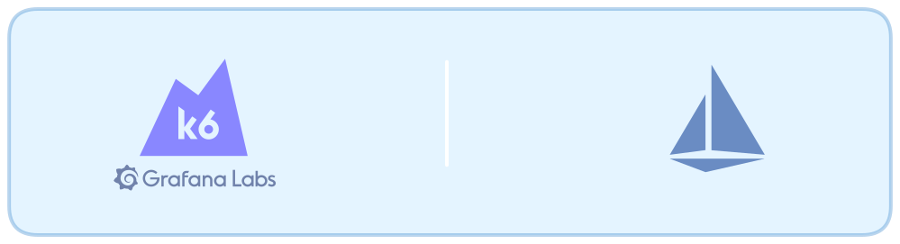
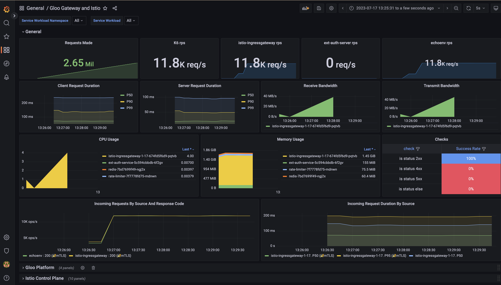
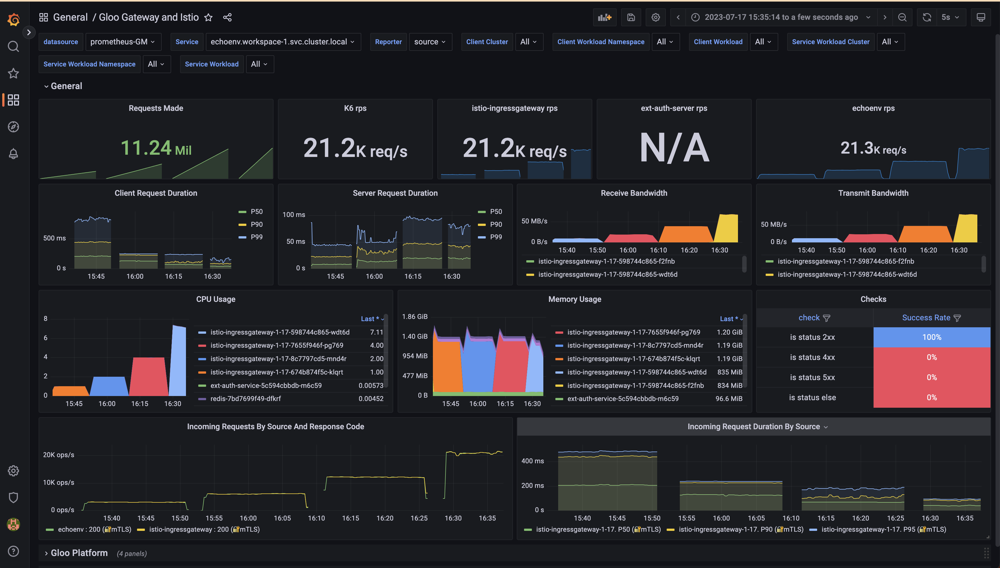
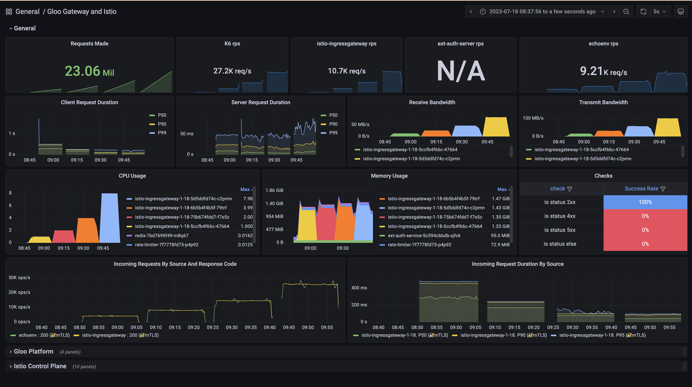
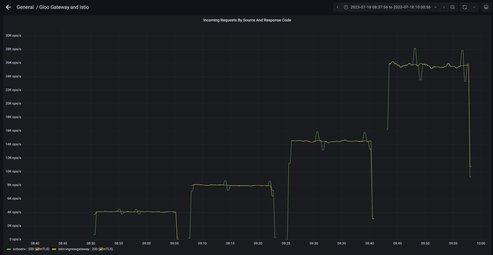

One of the most common questions we get from [solo](https://solo.io/) customers is about the number of replicas and architecture needed to use the **Istio Ingress Gateway** at scale.

The Istio Ingress Gateway is able to sustain a decent amount of traffic for the average application. But how much is that? At what cost? Is it robust?

We will try to answer those questions using a non-trivial setup. To do that, we are going to configure **1000 unique dns domains**, each one of them exposed with TLS certificate, and serving **100 different paths**. If you are familiar with envoy, this is about 150MB of [envoy configdump](https://envoyui.solo.io/).

The relevant parameters we are going to consider are CPU and memory consumption, response times and response codes. We are also going to observe the receive/transmit bandwidth, and deduce the key resources when we make envoy suffer a little. 

> ℹ️ **_NOTE:_** The complete set of scripts and code used to write this blogpost can be found in [this repo](./scripts/)

## Setting Up the Istio Ingress Gateway and Grafana for Observability

To properly test the Istio Ingress Gateway under load and gain observability into its performance, Grafana tools can be used. Specifically, the open-source K6 load testing tool from Grafana Labs and pre-built Istio dashboards in Grafana.

### Setting Up the Environment

We will use a single EKS cluster, composed of different nodes:
- 6x t3.2xlarge (8cpu/32Gi) for general purpose
- 1x c5.4xlarge (16cpu/32Gi) for the Istio Ingress Gateway
- 6x t3.medium (2cpu/4Gi) to execute the tests

First, deploy an Istio Ingress Gateway in the Kubernetes cluster. To do this, we are going to use the `Istio Lifecycle Manager`, but any other supported [method](https://istio.io/latest/docs/setup/install/) is also fine.

Then, install the [K6 operator](https://github.com/grafana/k6-operator) (version 0.0.9 was used to write this blogpost) and Grafana with the Istio dashboards.

### Configuring the Ingress Gateway

The Istio Ingress Gateway acts as a reverse proxy to route external traffic to services in the cluster. It can actually route traffic to other external services, but let’s keep it simple.

For testing, configure the gateway to route traffic to a sample app, in this case the [echoenv](http://quay.io/simonkrenger/echoenv) image as we did in [other blogposts](https://www.solo.io/blog/envoy-at-scale-with-gloo-edge/). This can be done by creating an Istio VirtualService that routes traffic from the ingress gateway to the app.

We will be using a `Routetable` to generate the necessary Istio resources, but you can create the VS directly as well:

```yaml
apiVersion: networking.istio.io/v1beta1
kind: Gateway
  name: virtualgateway-wrk-1-istio-gate-cf1809a3fba74fedbc2582a5c8f27ba
  namespace: istio-gateways
spec:
  selector:
    app: istio-ingressgateway
    istio: ingressgateway
    revision: 1-18
  servers:
  - hosts:
    - workspace-1-domain-1.com
    port:
      name: https-8443-workspace-1-domain-1-com
      number: 8443
      protocol: HTTPS
    tls:
      credentialName: wrk-1
      mode: SIMPLE
  [...]
  - hosts:
    - workspace-1-domain-100.com
    port:
      name: https-8443-workspace-1-domain-100-com
      number: 8443
      protocol: HTTPS
    tls:
      credentialName: wrk-1
      mode: SIMPLE
---  
apiVersion: networking.istio.io/v1beta1
kind: VirtualService
metadata:
  name: routetable-wrk-1-dom-1-istio-gateways-cluster1-gateways
  namespace: istio-gateways
spec:
  exportTo:
  - .
  gateways:
  - virtualgateway-wrk-1-istio-gate-cf1809a3fba74fedbc2582a5c8f27ba
  hosts:
  - workspace-1-domain-1.com
  http:
  - match:
    - sourceLabels:
        app: istio-ingressgateway
        istio: ingressgateway
        revision: 1-18
      uri:
        exact: /get/1
    [...]
    - sourceLabels:
        app: istio-ingressgateway
        istio: ingressgateway
        revision: 1-18
      uri:
        exact: /get/100
    name: echoenv-dom-1-echoenv.workspace-1.cluster1--wrk-1-dom-1.istio-gateways.cluster1
    rewrite:
      uri: /
    route:
    - destination:
        host: echoenv.workspace-1.svc.cluster.local
        port:
          number: 8000
```

The Istio Ingress Gateway is now ready to serve 1000 different domains, each one of them with 100 unique paths configured, like `https://workspace-10-domain-100.com/get/100`

### Running the K6 Load Test

To be able to send a high amount of traffic to the Istio Ingress Gateway, we can't rely on a single machine. Our test executor must be distributed.

Grafana K6 operator was designed to address this issue, and it is really simple to use, after the initial installation, we just create a `K6` resource:

```yaml
apiVersion: k6.io/v1alpha1
kind: K6
metadata:
  name: k6-runner
  namespace: k6
spec:
  parallelism: 18 # num machines * 3
  script:
    configMap:
      name: k6-test
      file: k6-test-single.js
  separate: false
  arguments: -o experimental-prometheus-rw
  runner:
    image: loadimpact/k6
    env:
    - name: K6_PROMETHEUS_RW_SERVER_URL
      value: http://kube-prometheus-stack-prometheus.monitoring.svc.cluster.local:9090/api/v1/write
    - name : K6_PROMETHEUS_RW_TREND_STATS
      value: p(90),p(95),max
    - name: K6_PROMETHEUS_RW_STALE_MARKERS
      value: "true"
    securityContext:
      runAsUser: 1000
      runAsGroup: 1000
      runAsNonRoot: true
      sysctls:
      - name: net.ipv4.ip_local_port_range
        value: "1024 65535"
    affinity:
      nodeAffinity:
        requiredDuringSchedulingIgnoredDuringExecution:
          nodeSelectorTerms:
          - matchExpressions:
            - key: eks.amazonaws.com/nodegroup
              operator: In
              values:
              - n2-4-t3-medium
    tolerations:
    - key: k6
      operator: Exists
      effect: NoSchedule
    resources:
      limits:
        cpu: 1100m
        memory: 8000Mi
      requests:
        cpu: 500m
        memory: 350Mi
```

Let's also have a look at the actual K6 test, located in a configmap:
```shell
kubectl create configmap k6-test --from-file k6-test-single.js
```

You can see that the test is using one of the well-known [K6 executors](https://k6.io/docs/using-k6/scenarios/executors/), so it is really just a few lines of code:

```js
import http from 'k6/http';
import { sleep, check } from 'k6';

export let options = {
  insecureSkipTLSVerify: true,
  discardResponseBodies: true,

  scenarios: {
    one: {
      executor: 'constant-vus',
      vus: 2000,
      duration: '15m',
      exec: 'nofilters'
    },
  },
};

export function nofilters() {
  const params = {
    tags: { name: 'singleMetricDynamicURL' },
  };
  const rnd2 = 1 + Math.floor(Math.random() * 50);
  const res = http.get(`https://workspace-1-domain-1.com/get/${rnd2}`, params);//no filters
  check(res, {
    'is status 2xx': (r) => parseInt(r.status / 100) === 2 ,
    'is status 4xx': (r) => parseInt(r.status / 100) === 4 ,
    'is status 5xx': (r) => parseInt(r.status / 100) === 5 ,
    'is status else': (r) => parseInt(r.status / 100) !== 2 && parseInt(r.status / 100) !== 4 && parseInt(r.status / 100) !== 5,
  });
  //sleep(1);
}
```

### Viewing Metrics in Grafana

While the load test is running, Grafana dashboards provide visibility into how the ingress gateway is performing under load. Dashboards show metrics like request rates, response times, error rates, and resource saturation. This data can be used to determine maximum load the gateway can handle as well as potential bottlenecks.

In the custom dashboard, we can see metrics coming from different sources:
- Istio Ingress Gateway
  - Total of request made during the test
  - RPS from different perspectives (K6, Istio IG, Destination)
  - CPU/Memory usage
  - Request duration and response codes
- Istio Control Plane: Not relevant for this blogpost
- Gloo Platform: Not relevant for this blogpost



## Load Testing the Istio Ingress Gateway With K6

To properly test the performance and reliability of Istio's Ingress Gateway, it's important to simulate traffic at high volumes. We will run a script to limit the CPU that the Ingress Gateway can use:

```shell
CPU=1000m MEMORY=4Gi bash k6-gw.sh
sleep 120
kubectl --context ${MGMT} -n istio-gateways rollout status deployment istio-ingressgateway-1-18
bash k6.sh

CPU=2000m MEMORY=4Gi bash k6-gw.sh
sleep 120
kubectl --context ${MGMT} -n istio-gateways rollout status deployment istio-ingressgateway-1-18
bash k6.sh

CPU=4000m MEMORY=4Gi bash k6-gw.sh
sleep 120
kubectl --context ${MGMT} -n istio-gateways rollout status deployment istio-ingressgateway-1-18
bash k6.sh

CPU=8000m MEMORY=4Gi bash k6-gw.sh
sleep 120
kubectl --context ${MGMT} -n istio-gateways rollout status deployment istio-ingressgateway-1-18
bash k6.sh
```

```shell
# file k6.sh
#for TEST_NAME in all wasmplugin onlyextauth onlywaf nofilters direct; do
for TEST_NAME in nofilters; do
kubectl --context ${CLUSTER1} delete configmap k6-test -n k6
sed -i "" "s/exec:.*/exec: '$TEST_NAME'/g" k6-test-single.js
kubectl --context ${CLUSTER1} create configmap k6-test --from-file k6-test.js --from-file k6-test-single.js --from-file k6-test-quick.js  -n k6
kubectl --context ${CLUSTER1} delete -f k6-runner.yaml -n k6
sed -i "" "s/file:.*/file: k6-test-single.js/g" k6-runner.yaml

kubectl --context ${CLUSTER1} apply -f k6-runner.yaml -n k6
date
echo "Waiting for test $TEST_NAME to be finished"
sleep 10
while test $(kubectl --context ${MGMT} -n k6 get po|grep Running|wc -l) -gt "0"; do printf "." && sleep 1; done
duration=$SECONDS
echo "$(($duration / 60)) minutes and $(($duration % 60)) seconds elapsed to execute test $TEST_NAME"
done
```

This simple scenario will send GET requests to the /get/n endpoint of the Ingress Gateway, that will rewrite the request to be sent to / in the upstream server.

Once K6 operator is in action, you will see that it creates 18 pods, each one of them executing a portion of the total requests to be sent.

Using this approach, you can use many cheap spot machines for your tests, for a virtually **unlimited** throughput:

```yaml
  containers:
    - name: k6
      image: loadimpact/k6
      command:
        - k6
        - run
        - '--quiet'
        - '--execution-segment=10/18:11/18'
        - >-
          --execution-segment-sequence=0,1/18,2/18,3/18,4/18,5/18,6/18,7/18,8/18,9/18,10/18,11/18,12/18,13/18,14/18,15/18,16/18,17/18,1
        - '-o'
        - experimental-prometheus-rw
        - /test/k6-test-single.js
        - '--address=0.0.0.0:6565'
        - '--paused'
        - '--tag'
        - instance_id=11
        - '--tag'
        - job_name=k6-runner-11
      ports:
        - containerPort: 6565
          protocol: TCP
      env:
        - name: K6_PROMETHEUS_RW_SERVER_URL
          value: >-
            http://kube-prometheus-stack-prometheus.monitoring.svc.cluster.local:9090/api/v1/write
        - name: K6_PROMETHEUS_RW_TREND_STATS
          value: p(90),p(95),max
        - name: K6_PROMETHEUS_RW_STALE_MARKERS
          value: 'true'
```

Another cool thing about these many tester pods is that they produce metrics, so you can ship them to an external prometheus, like we are doing.

It is also possible to ship them to an [OpenTelemetry](https://opentelemetry.io/) collector, where we can manipulate them before sending them to the final destination, which is usually a prometheus instance.

## Visualizing the Istio Ingress Gateway Metrics in Grafana

After some time, you can have a very nice overview of what is happening in the system.



As we know from [envoy at scale](https://www.solo.io/blog/envoy-at-scale-with-gloo-edge/) data, envoy can well sustain a little bit more than **2,000 RPS per CPU**, so that was our expectation at the time of writing.

The version used for this test is the 1.18.0, curated by solo. It is essentially a hardened version of upstream Istio, with some enterprise filters that we won't use for this test.

You can find the image in the [workshops](https://github.com/solo-io/workshops) repository:
```
us-docker.pkg.dev/gloo-mesh/istio-workshops/proxyv2:1.18.0-solo
```

## Analyzing the Istio Ingress Gateway Performance Under Load

To analyze the performance of the Istio Ingress Gateway under load, let's observe the final snapshot of our 4-phase test:



### First row: Total requests made and RPS

We were able to send a few million requests to the gateway in 4 intervals of 15 minutes. The number we see in the picture belongs to the last 15-minute phase.

We can also see that in the last moment of the test, K6 was sending ~27k RPS, Istio IngressGateway was processing at 10.7k, and the application ~9k RPS. This discrepancy is expected, as the counters are only useful for realtime and based on prometheus formulas like:

> sum(irate(k6_http_reqs_total[1m]))

### Second row: Request duration and bandwidth

In the 2 left panels, we can observe that the request duration at percentile 50, 90 and 99. In this context, client is the Istio Ingress Gateway and server is the application.

In the 2 right panels, we can see the network traffic used by the gateway, which is 83 MB/s receive and 101 MB/s in the yellow block.

This is really useful information, as you can imagine using the gateway at scale is only possible if we can provide the network capacity that is needed for all services exposed in the gateway, and also the traffic coming from the downstream.

> ℹ️ **_NOTE:_**  In production, you will want to use many replicas of the Istio Ingress Gateway, so the input/output network restrictions are divided among them. The goal of this blogpost is to see how well a single replica can perform.

### Third row: Resource usage

One of the well-known limiting factors of envoy is cpu. The more CPU you give it, the more RPS you can get. This is why we can see that in each of the 15-minute phases, envoy is using all CPU that it is available, so we can confirm that it is not wasting it.

From a memory perspective, we can observe that it is stable around 1.3Gi - 1.5Gi. The memory is used to store envoy configuration (in our case 1000 different domains), so once it is started you can expect it to be stable even under heavy load.

During our load testing, not a single error was observed. This metric is coming from K6 executors, so the _producers_ of the initial requests.

### Last row: Requests per second and response codes

This one is the most interesting, as we mentioned we expected something around ~2k RPS, but the actual numbers were a bit higher:

> - ~4k RPS using 1 cpu = 345 million requests per day
> - ~8k RPS using 2 cpu = 690 million requests per day
> - ~14.5k RPS using 4 cpu = 1.2 billion requests per day
> - ~26k RPS using 8 cpu = 2.2 billion requests per day



## Conclusion

In summary, by combining [Grafana K6 load testing tool](https://k6.io/) with [Grafana dashboards](https://grafana.com/grafana/dashboards/), developers can easily analyze [Istio Ingress Gateway](https://istio.io/latest/docs/tasks/traffic-management/ingress/ingress-control/) performance under high loads. The K6 tool allows generating large volumes of traffic to stress test the gateway, while the Grafana dashboards provide detailed insights into metrics like request rates, response times, and error rates.

Using this approach, Istio operators can identify bottlenecks, ensure high availability, and optimize configurations to handle increased traffic demands as adoption of the service mesh grows within an organization. With the ability to simulate real user scenarios at scale, developers gain valuable insights to build and operate a robust Istio infrastructure.

A single replica of Istio Ingress Gateway is good enough for many production-grade applications, and combining it with an automated horizontal scaling of the gateway will make it real a solid solution for most applications.

However, to have High Availability in addition to a good performance, a [multicluster approach](https://docs.solo.io/gloo-mesh-enterprise/main/concepts/about/benefits/#multicluster-benefits) is recommended, as a cluster-wide failure can make a lot of harm to your business if you rely on a single-cluster approach.

To learn how you can do this, step by step:

[](https://youtu.be/94vhMLqMqbI "Video Link")